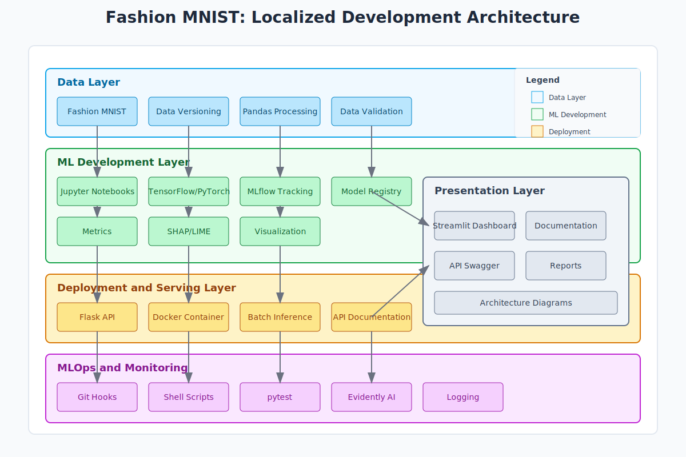
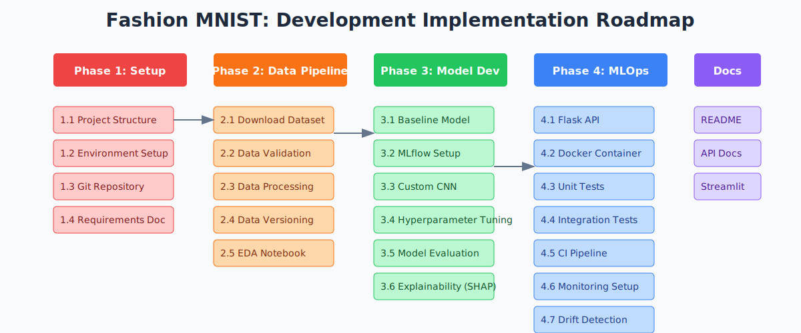

# Fashion MNIST: Strictly Localized Development Approach





## Phase 1: Business Understanding & Problem Definition

### Implementation Details
- Create project charter in Markdown format
- Document stakeholder requirements in YAML/JSON
- Define success metrics in a metrics tracking file
- Establish project timeline in Gantt chart format (local tools)

### Technical Specifications
- Use Git for documentation version control
- Structure: `docs/business/` directory
- Format: Markdown, YAML, JSON files

### Best Practices
- Document SMART goals
- Define clear KPIs
- Regular review checkpoints
- Stakeholder sign-off documentation

## Phase 2: Data Engineering & Preparation

### Implementation Details
- Download Fashion MNIST to local filesystem
- Implement data versioning with folder structure (data/v1, data/v2)
- Create data validation scripts using pandas
- Store metadata in JSON files
- Develop data preprocessing pipelines

### Technical Specifications
- Storage: Local filesystem
- Validation: pandas, numpy
- Version control: Manual versioning or DVC
- Directory structure: `data/raw/`, `data/processed/`

### Best Practices
- Implement data quality checks
- Document data lineage
- Version control datasets
- Create data dictionaries
- Maintain data catalog

## Phase 3: Model Development & Training

### Implementation Details
- Use Jupyter notebooks for experimentation
- Implement models with TensorFlow/PyTorch
- Train on local CPU/GPU
- Use MLflow for local experiment tracking
- Store model artifacts locally

### Technical Specifications
- Environment: conda/venv
- Frameworks: TensorFlow 2.x, PyTorch 1.x
- Tracking: MLflow (local mode)
- Storage: `models/` directory

### Best Practices
- Set random seeds for reproducibility
- Document hyperparameters
- Version control notebooks
- Modular code structure
- Comprehensive logging

## Phase 4: Model Evaluation & Validation

### Implementation Details
- Implement evaluation metrics
- Create visualization dashboards with matplotlib
- Use SHAP/LIME for explainability
- Perform bias testing
- Generate performance reports

### Technical Specifications
- Metrics: scikit-learn
- Visualization: matplotlib, seaborn
- Explainability: SHAP, LIME
- Reports: Jupyter, Markdown

### Best Practices
- Cross-validation
- Confusion matrices
- ROC curves
- Feature importance analysis
- Bias detection

## Phase 5: Deployment & Serving

### Implementation Details
- Create Flask/FastAPI endpoints
- Containerize with Docker
- Implement batch inference scripts
- Set up local model registry
- Create API documentation

### Technical Specifications
- API: Flask/FastAPI
- Containerization: Docker
- Registry: Local filesystem
- Documentation: Swagger/OpenAPI

### Best Practices
- API versioning
- Health check endpoints
- Error handling
- Input validation
- Rate limiting

## Phase 6: Monitoring & Maintenance

### Implementation Details
- Implement logging with Python logging module
- Create performance monitoring scripts
- Use Evidently AI for drift detection
- Store metrics locally
- Set up alert scripts

### Technical Specifications
- Logging: Python logging
- Monitoring: Custom scripts
- Drift detection: Evidently AI
- Storage: CSV/JSON files

### Best Practices
- Log rotation
- Metric collection
- Drift thresholds
- Alert conditions
- Performance baselines

## Phase 7: MLOps & Automation

### Implementation Details
- Use Git hooks for automation
- Create shell scripts for pipeline automation
- Implement local CI with GitHub Actions (self-hosted)
- Use Docker Compose for local infrastructure
- Automate testing with pytest

### Technical Specifications
- Version control: Git
- Automation: Shell scripts, Make
- Testing: pytest
- Infrastructure: Docker Compose
- Infrastructure: Docker Compose only

### Best Practices
- Automated testing
- Code linting
- Pre-commit hooks
- Pipeline automation
- Documentation generation

## Phase 8: Presentation & Documentation

### Implementation Details
- Create documentation with Markdown
- Build dashboards with Streamlit
- Generate API docs with Swagger
- Create architecture diagrams
- Develop presentation materials

### Technical Specifications
- Documentation: Markdown, MkDocs
- Dashboards: Streamlit, Dash
- Diagrams: Draw.io, PlantUML
- Presentations: Local tools

### Best Practices
- README templates
- Code comments
- API documentation
- Architecture diagrams
- User guides

## Phase 9: Real-World Experimentation

### Implementation Details
- Create test datasets
- Implement A/B testing framework
- Develop performance benchmarking
- Validate with real images
- Document experiment results

### Technical Specifications
- Testing: Custom scripts
- Benchmarking: Python tools
- Validation: Manual processes
- Results: JSON/CSV storage

### Best Practices
- Controlled experiments
- Statistical validation
- Result documentation
- Performance comparison
- Reproducible tests

## Directory Structure
```
fashion-mnist-localized/
├── data/                  # Dataset versions
│   ├── raw/              # Original data
│   └── processed/        # Processed data
├── notebooks/            # Jupyter notebooks
├── src/                  # Source code
│   ├── data/            # Data processing
│   ├── models/          # Model definitions
│   ├── training/        # Training scripts
│   └── serving/         # API code
├── models/               # Trained models
├── experiments/          # MLflow experiments
├── logs/                 # Application logs
├── tests/                # Test suites
├── docs/                 # Documentation
│   ├── business/        # Business docs
│   └── technical/       # Technical docs
├── deployment/           # Deployment configs
│   └── docker/          # Docker files
└── monitoring/           # Monitoring scripts
```

## Infrastructure Requirements
- Local machine: 16GB+ RAM
- Storage: 50GB+ SSD
- Optional: NVIDIA GPU
- Python 3.8+
- Docker Desktop

This organization provides a clear, phase-by-phase approach to implementing the Fashion MNIST project in a strictly localized environment while maintaining professional ML engineering standards.