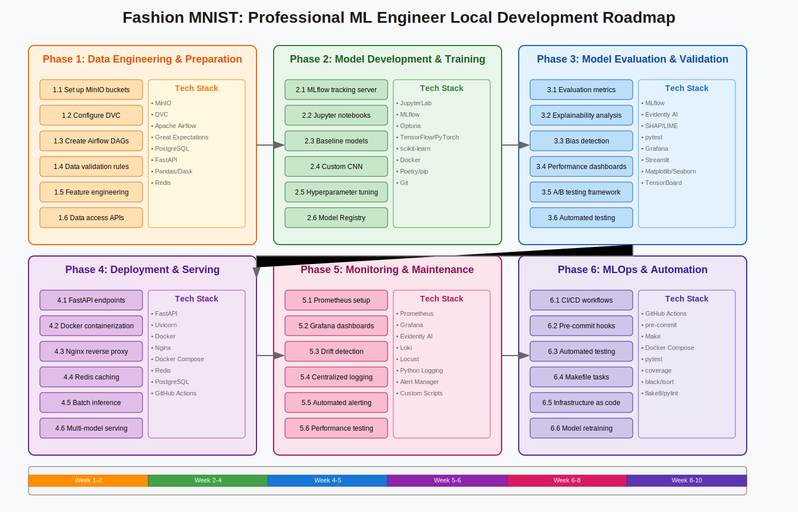

# Fashion MNIST: Professional ML Engineer Local Development

## Overview

This project demonstrates enterprise-grade ML engineering practices in a local development environment, showcasing the complete ML lifecycle for the Fashion MNIST dataset without cloud dependencies.

## Phase 1: Data Engineering & Preparation

### Data Storage & Versioning
- **MinIO**: S3-compatible object storage for datasets
- **DVC**: Version control for data and models
- **PostgreSQL**: Metadata storage and feature store
- **Redis**: Caching layer for frequently accessed data

### Data Processing Pipeline
- **Apache Airflow**: Orchestrate ETL workflows and data pipelines
- **Great Expectations**: Validate data quality and consistency
- **Pandas/Dask**: Process and transform data (with large dataset support)
- **FastAPI**: Build data access APIs for downstream consumption

### Implementation Tasks
1. Set up MinIO buckets for raw and processed data
2. Configure DVC for tracking data versions
3. Create Airflow DAGs for data ingestion and processing
4. Implement data validation rules with Great Expectations
5. Build feature engineering pipelines with Pandas/Dask
6. Develop data access APIs with FastAPI

## Phase 2: Model Development & Training

### Experimentation Environment
- **JupyterLab**: Interactive development and experimentation
- **MLflow**: Experiment tracking and model versioning
- **Optuna**: Hyperparameter optimization
- **Docker**: Reproducible training environments

### Model Development Tools
- **TensorFlow/PyTorch**: Deep learning frameworks
- **scikit-learn**: Traditional ML algorithms
- **Poetry/pip**: Dependency management
- **Git**: Version control for code

### Implementation Tasks
1. Set up MLflow tracking server for experiments
2. Create Jupyter notebooks for exploratory analysis
3. Develop baseline models using scikit-learn
4. Implement custom CNN architectures with TensorFlow/PyTorch
5. Perform hyperparameter tuning using Optuna
6. Register best models in MLflow Model Registry

## Phase 3: Model Evaluation & Validation

### Evaluation Framework
- **MLflow**: Metrics tracking and model comparison
- **Evidently AI**: Model performance analysis and drift detection
- **SHAP/LIME**: Model explainability
- **pytest**: Testing model functionality

### Visualization Tools
- **Grafana**: Performance dashboards
- **Streamlit**: Interactive model analysis
- **Matplotlib/Seaborn**: Static visualizations
- **TensorBoard**: Training visualization

### Implementation Tasks
1. Implement comprehensive evaluation metrics in MLflow
2. Create model explainability analysis with SHAP
3. Build bias detection pipeline with Evidently AI
4. Develop performance visualization dashboards
5. Set up A/B testing framework for model comparison
6. Create automated testing suite with pytest

## Phase 4: Deployment & Serving

### Serving Infrastructure
- **FastAPI**: High-performance REST API
- **Uvicorn**: ASGI server for FastAPI
- **Docker**: Containerization for deployment
- **Nginx**: Reverse proxy and load balancing

### Deployment Tools
- **Docker Compose**: Multi-container orchestration
- **Redis**: Caching for model predictions
- **PostgreSQL**: Store prediction logs
- **GitHub Actions**: Deployment automation

### Implementation Tasks
1. Create FastAPI endpoints for model serving
2. Containerize model serving with Docker
3. Set up Nginx as reverse proxy
4. Implement Redis caching for predictions
5. Configure batch inference pipeline
6. Deploy multi-model serving infrastructure

## Phase 5: Monitoring & Maintenance

### Monitoring Stack
- **Prometheus**: Metrics collection
- **Grafana**: Real-time monitoring dashboards
- **Evidently AI**: Data and model drift detection
- **Loki**: Log aggregation

### Performance Tools
- **Locust**: Load testing and performance benchmarking
- **Python Logging**: Application logging
- **Alert Manager**: Automated alerting
- **Custom Scripts**: Health checks and diagnostics

### Implementation Tasks
1. Set up Prometheus metrics exporters
2. Create Grafana dashboards for model performance
3. Implement drift detection with Evidently AI
4. Configure centralized logging with Loki
5. Develop automated alerting for anomalies
6. Create performance benchmarking suite with Locust

## Phase 6: MLOps & Automation

### CI/CD Pipeline
- **GitHub Actions**: Workflow automation (with act for local testing)
- **pre-commit**: Code quality checks
- **Make**: Task automation
- **Docker Compose**: Infrastructure as code

### Testing & Quality
- **pytest**: Unit and integration testing
- **coverage**: Code coverage reporting
- **black/isort**: Code formatting
- **flake8/pylint**: Code linting

### Implementation Tasks
1. Create GitHub Actions workflows for CI/CD
2. Implement pre-commit hooks for code quality
3. Develop automated testing pipeline
4. Create Makefile for common tasks
5. Set up infrastructure as code with Docker Compose
6. Implement automated model retraining pipeline

## Phase 7: Presentation & Documentation

### Documentation Tools
- **MkDocs Material**: Project documentation
- **Jupyter Book**: Technical reports and notebooks
- **draw.io**: Architecture diagrams
- **OpenAPI/Swagger**: API documentation

### Interactive Dashboards
- **Streamlit**: Model demo applications
- **Grafana**: Operational dashboards
- **Plotly/Dash**: Custom visualizations
- **FastAPI**: Swagger UI for API exploration

### Implementation Tasks
1. Create comprehensive documentation with MkDocs
2. Build interactive model demo with Streamlit
3. Generate API documentation with Swagger
4. Develop architecture diagrams with draw.io
5. Create operational dashboards with Grafana
6. Build custom visualization tools for stakeholders

## Phase 8: Real-World Experimentation

### Testing Framework
- **Locust**: Load testing for production scenarios
- **pytest**: Custom test scenarios
- **Custom Scripts**: A/B testing implementation
- **FastAPI**: Test data endpoints

### Validation Tools
- **Evidently AI**: Real-world performance tracking
- **MLflow**: Experiment comparison
- **Grafana**: Results visualization
- **Custom Reports**: Statistical analysis

### Implementation Tasks
1. Develop A/B testing framework
2. Create load testing scenarios with Locust
3. Implement real-image validation pipeline
4. Build performance comparison dashboards
5. Create statistical analysis reports
6. Document experiment results and learnings

## Infrastructure Requirements

### Minimum Specifications
- 16GB RAM
- 4 CPU cores
- 256GB SSD
- Docker & Docker Compose

### Recommended Specifications
- 32GB RAM
- 8 CPU cores
- 512GB SSD
- NVIDIA GPU (optional)

## Getting Started

The entire infrastructure can be started with a single Docker Compose command, demonstrating professional ML engineering practices on a single machine while maintaining enterprise-grade standards.